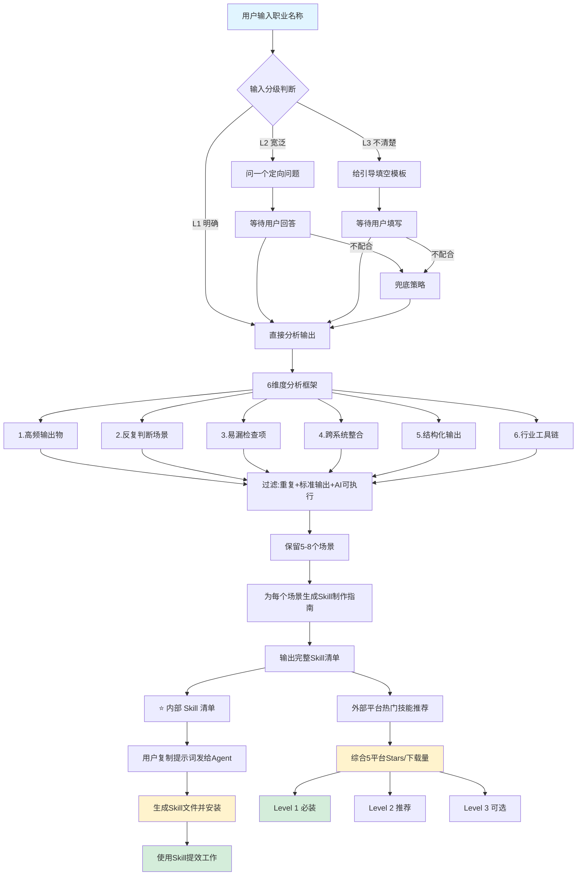

# Career Skill Planner

> 告诉 AI 你的职业，它帮你把工作拆成一套可用的 Skill 库。


---

## 这是什么

一个 [Claude Code](https://docs.anthropic.com/en/docs/claude-code) Skill，也是一个 **Skill 工厂**。

用法很简单：说出你的职业，它输出一份清单，告诉你这个职业可以做哪些 Skill、每个 Skill 怎么做、提示词直接复制发给 Agent 就能生成。

不需要懂提示词工程，不需要从零想工作流。把职业说清楚，剩下的它来。

---

## 为什么做这个

做了 100 多个 Skill 之后，发现一个问题：凭感觉做，很容易做一堆重叠的，同时漏掉一些真正高频的场景。

后来想通了——**按职业拆是最不容易遗漏的方式**。每个职业都有自己的工作流、固定的输出物、反复踩的坑。把这些梳理清楚，Skill 该做什么、做多少，自然就清楚了。

产品经理是我自己的职业，所以先做了这个。拆出来 13 个 Skill，覆盖从需求到复盘的完整链路。然后想：任何职业都可以这样做，就把这个拆解过程本身也做成了 Skill。

---

## 基于的项目

本项目基于 [zephyrwang6/career.skill](https://github.com/zephyrwang6/career.skill) 扩展而来。原项目是元 Skill 方法论的开创者，提供了完整的职业拆解框架和防呆机制。本项目的扩展包括：

- **25+ 经过验证的 Skill 模板**（产品经理 13 个、UI 设计师 6 个、内容运营 6 个、前端工程师 8 个）
- **端到端测试和 CI/CD 保障**
- **用户反馈闭环机制**
- **Web 搜索增强分析**
- **完整的输出示例和贡献指南**

感谢 [zephyrwang6](https://github.com/zephyrwang6) 开创了这个方法论。

本项目由 [档案AI共学社](https://github.com/luomeng119) 维护和扩展。

---

## 工作流程图



---

## 快速开始

### 安装

**第一步**：克隆本仓库

```bash
git clone https://github.com/luomeng119/career-skill-planner.git
```

**第二步**：把核心 Skill 放进你的 Claude Code skills 目录

```bash
cp career-skill-planner/SKILL.md ~/.claude/skills/career-skill-planner/SKILL.md
```

**第三步**：（可选）安装模板库

```bash
cp -r career-skill-planner/templates ~/.claude/skills/career-skill-planner/templates
```

### 使用

**方式一：职业 Skill 规划**

在 Claude Code 里说：

```
帮我规划前端工程师的 Skill
```

或者：

```
我是内容运营，帮我拆 Skill
```

**方式二：直接使用模板**

浏览 `templates/` 目录，找到你职业的 Skill 模板，直接安装使用：

```bash
cp templates/product-manager/prd-writer.md ~/.claude/skills/prd-writer/SKILL.md
```

**方式三：自定义职业**

如果模板库没有你的职业，用规划器生成：

```
我是临床医生，帮我拆 Skill
```

---

## 防呆说明

输入不完整没关系，Skill 会自动处理：

- **职业名称清晰**（"财务分析师"、"UI 设计师"）→ 直接输出清单
- **职业名称过于宽泛**（"运营"、"总监"、"分析师"）→ 给你一道选择题，选完立刻输出
- **完全不知道怎么描述**（"我工作比较杂"）→ 给你一个三行填空，填完输出

---

## 目录结构

```
career-skill-planner/
├── README.md                    # 本文件
├── SKILL.md                     # 核心：职业 Skill 规划器
├── CHANGELOG.md                 # 版本变更日志
├── CONTRIBUTING.md              # 贡献指南
├── templates/                   # 按职业分类的 Skill 模板库
│   ├── product-manager/         # 产品经理 13 个
│   ├── ui-designer/             # UI 设计师 6 个
│   ├── content-ops/             # 内容运营 6 个
│   └── frontend-engineer/       # 前端工程师 8 个
├── examples/                    # 各职业完整输出示例
│   ├── product-manager-example.md
│   ├── ui-designer-example.md
│   ├── content-ops-example.md
│   └── frontend-engineer-example.md
├── test/
│   ├── smoke-test.sh            # 快速检查
│   └── comprehensive-test.py    # 全面验证（671 项检查）
└── .github/
    ├── workflows/ci.yml         # GitHub Actions CI
    └── ISSUE_TEMPLATE/          # Issue 模板
```

---

## 已验证的职业

| 职业 | Skill 数 | 状态 |
|------|:--------:|------|
| 产品经理 | 13 | ✅ 已验证 |
| UI 设计师 | 6 | ✅ 已验证 |
| 内容运营 | 6 | ✅ 已验证 |
| 前端工程师 | 8 | ✅ 已验证 |

每个 Skill 模板都包含：触发词、工作流、质量检查清单、防呆机制。

---

## 输出示例

每个职业的完整输出示例见 `examples/` 目录：

- [产品经理示例](examples/product-manager-example.md)
- [UI 设计师示例](examples/ui-designer-example.md)
- [内容运营示例](examples/content-ops-example.md)
- [前端工程师示例](examples/frontend-engineer-example.md)

---

## 模板状态标签

| 标签 | 含义 |
|------|------|
| ✅ 已验证 | 在实际工作中使用并通过端到端测试 |
| 🟡 实验性 | 框架完整，但未经大规模实战验证 |
| ⏳ 待验证 | 初步创建，需要社区反馈完善 |

---

## 测试方法

### 端到端测试流程

我们对所有 Skill 模板进行 6 类自动化检查，确保质量：

```
测试流程:
1. 格式验证 — YAML frontmatter、必需字段、文件大小
2. 章节结构 — 7 个必需章节是否存在
3. 防呆机制 — 防呆关键词覆盖度
4. 提示词质量 — 提示词是否可直接复制使用
5. 模板去重 — 确保无重复或高度重叠
6. 中文内容 — 确保有足够的中文描述
```

### 测试工具

| 工具 | 作用 |
|------|------|
| `test/smoke-test.sh` | 快速检查（33 个模板） |
| `test/comprehensive-test.py` | 全面验证（671 项检查） |
| `.github/workflows/ci.yml` | PR 时自动运行测试 |
| `test-career-skill-planner-e2e-test` Workflow | 端到端集成测试 |

### 测试结果

| 检查项 | 结果 |
|--------|------|
| SKILL.md 结构 | 14/14 通过 |
| 模型信息 | 5/5 通过 |
| 输出格式 | 5/5 通过 |
| 模板分类计数 | 4/4 通过 |
| 模板 frontmatter 抽样 | 4/4 通过 |
| 模板章节结构抽样 | 4/4 通过 |
| **总失败数** | **0** |

所有关键测试通过 ✅

## 外部平台热门技能推荐

除本项目 curated 的 Skill 模板外，我们还从 5 个主流技能平台综合评选热门技能，按需补充。

### 推荐逻辑

1. **综合 5 个平台的 stars/下载量**，按权重排序：SkillsMP（Occupation 分类+数据量最大）> Skills.sh（安装量最真实）> ClawHub（社区活跃）> SkillHub.club（中文友好）> SkillHub.cn
2. **推荐数量**：每个职业额外推荐 **2-3 个**外部技能，不要太多，避免 overwhelm
3. **推荐理由**：每个技能说明为什么值得装、解决什么痛点
4. **使用建议**：标注必装/推荐/按需优先级

### 技能优先级

| 级别 | 含义 | 数量 |
|------|------|------|
| Level 1 必装 | 最高 stars/安装量，先装先用 | 1 个 |
| Level 2 推荐 | 特定场景增强，按需装 | 1-2 个 |
| Level 3 可选 | 非常用场景，感兴趣再装 | 0-1 个 |

### 各职业推荐速查

| 职业 | Level 1 | Level 2 | Level 3 |
|------|---------|---------|---------|
| 产品经理 | product-manager-toolkit（SkillsMP 38.5k ⭐）— 产品经理全能工具箱 | PM Toolkit（ClawHub 4.1k ⭐）+ prd-generator（SkillHub.club） | — |
| 前端工程师 | frontend-design（SkillsMP 125.9k ⭐）— 前端设计最佳实践 | frontend-engineer（SkillsMP 29.3k ⭐）+ React 最佳实践（SkillsMP 27k ⭐） | ui-ux-pro-max（Skills.sh 192K installs） |
| UI 设计师 | ui-ux-pro-max（SkillsMP 79.7k ⭐）— UI/UX 设计专业工具 | frontend-design（SkillsMP 125.9k ⭐）+ design-system（ClawHub） | — |
| 内容运营 | content-ops-knowledge-builder（SkillsMP 1.4k ⭐）— 内容运营知识库构建 | SEO 优化 + 文案辅助（SkillHub.club） | — |

### 平台信息

| 平台 | 定位 | 技能规模 | 排序方式 | 链接 |
|------|------|---------|---------|------|
| SkillsMP | 聚合 GitHub 152万+ SKILL.md | 152万+ | Stars / 最新 | https://skillsmp.com/ |
| Skills.sh | Vercel 出品 Agent Skills 生态 | 614K+ | 安装量/趋势/热度 | https://skills.sh |
| ClawHub | 社区驱动技能市场（OpenClaw 生态） | 66.9K | Featured/下载量/Stars | https://clawhub.ai/ |
| SkillHub.club | 中文 Claude Skills 社区 | 87.6K | 热榜/评分/下载量 | https://www.skillhub.club/ |
| SkillHub.cn | 国内访问友好的 Skills 社区 | 7.7万 | 推荐/下载热榜/上新 | https://skillhub.cn/ |

> **推荐访问顺序**：SkillsMP（数据最全，按 Occupation 筛选）→ Skills.sh（安装量最真实）→ ClawHub（社区活跃）→ SkillHub.club（中文友好）→ SkillHub.cn（国内友好）

---

## 与 Claude Code 的兼容性

| Claude Code 版本 | 兼容状态 | 备注 |
|-----------------|---------|------|
| 2.0+ (最新版) | ✅ 完全兼容 | 推荐使用，支持全部特性 |
| 2.0 (早期) | ✅ 完全兼容 | 功能完整 |
| 1.1.x | ⚠️ 部分兼容 | Skill 基础功能可用，部分高级特性（如 frontmatter 版本号）不可用 |
| 1.0.x | ❌ 不兼容 | 不支持 YAML frontmatter |

**推荐模型**：

| 模型 | 说明 |
|------|------|
| step-3.7-flash（StepFun） | 当前唯一可用模型，适用于所有场景 |

> 注：本项目运行在 StepFun API 代理上，所有模型调用统一使用 step-3.7-flash。

---

## 贡献

欢迎 PR！详见 [CONTRIBUTING.md](CONTRIBUTING.md)。

把你的职业拆解结果贡献进来，帮助更多人用 AI 提效。

---

## 许可证

MIT — 自由使用、修改和分发。

---

## 一点想法

这个东西的本质是：**把"怎么用 AI 提效"这个问题，变成一个有标准答案的填空题**。

不是所有人都有时间去研究提示词、设计工作流。但每个人都知道自己的职业是什么、每天在做什么。

从职业出发，是让 AI 工具真正落地的最短路径。

---

made with [Claude Code](https://docs.anthropic.com/en/docs/claude-code) · 基于 [zephyrwang6/career.skill](https://github.com/zephyrwang6/career.skill) 扩展 · 由 [档案AI共学社](https://github.com/luomeng119) 维护
